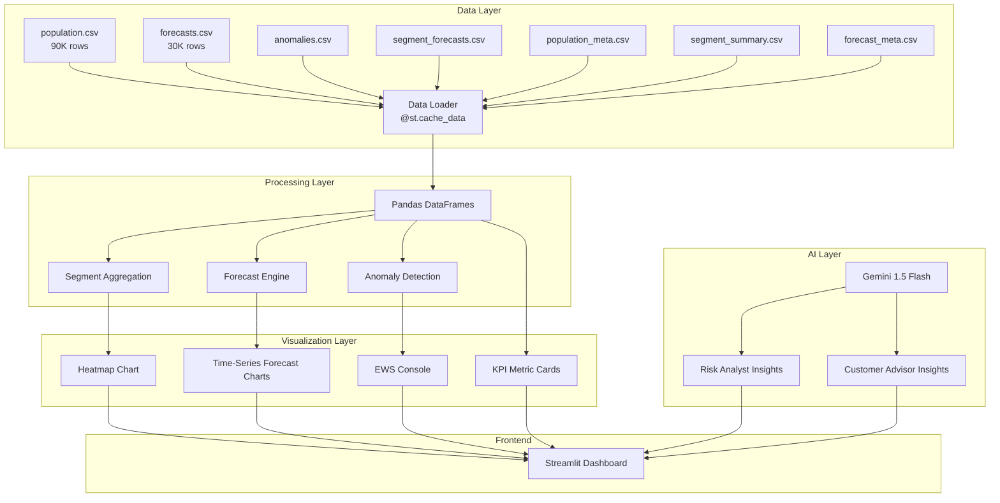
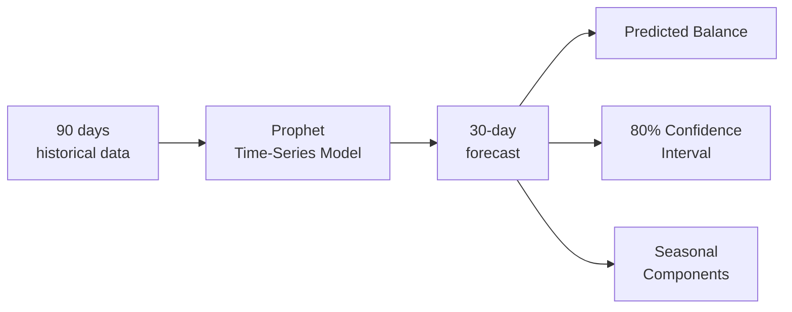

# NatWest FinPulse — Dynamic Exposure Monitor
## Complete Project Documentation

---

## 1. Project Overview

**NatWest FinPulse** is a real-time **Dynamic Exposure Monitor** built for NatWest bank. It provides a comprehensive liquidity risk intelligence dashboard that monitors **1,000 retail banking customers** across **8 behavioral segments**, forecasts their financial health over the next **30 days**, and triggers **Early Warning Signals (EWS)** when customers are at risk of overdraft or financial distress.

### What Problem Does It Solve?

Banks need to proactively identify customers who are heading toward financial difficulty — **before** they actually go into overdraft. Traditional systems are reactive (they flag problems *after* they happen). FinPulse is **predictive** — it uses time-series forecasting and anomaly detection to warn risk managers **days or weeks in advance**, allowing the bank to intervene early with appropriate products or support.

### Key Value Propositions

| For the Bank | For the Customer |
|---|---|
| Reduce overdraft losses | Get personalized financial guidance |
| Identify upsell opportunities | Avoid unexpected overdraft fees |
| Comply with FCA consumer duty | Receive proactive support |
| Automate risk monitoring at scale | Better understand spending patterns |

---

## 2. Technology Stack

### Core Technologies

| Technology | Version | Purpose |
|---|---|---|
| **Python** | 3.14 | Core programming language |
| **Streamlit** | 1.56+ | Web application framework — turns Python scripts into interactive dashboards |
| **Pandas** | 3.x | Data manipulation, CSV loading, time-series handling |
| **NumPy** | 2.x | Numerical computations, statistical calculations |
| **Plotly** | 6.7 | Interactive charting — heatmaps, time-series, scatter plots |
| **Google Gemini AI** | 1.5 Flash | Generative AI for natural-language risk insights |
| **python-dotenv** | 1.2 | Environment variable management (API keys) |

### Architecture Diagram



---

## 3. Data Architecture — The 7 CSV Files

The application loads **7 CSV data files** at startup. Here's what each one contains and how it's used:

### 3.1 `population.csv` — Daily Customer Balances (90K rows)

| Column | Type | Description |
|---|---|---|
| `customer_id` | string | Unique ID like "NW000001" |
| `date` | datetime | Daily date |
| `segment` | string | Behavioral segment |
| `balance` | float | Account balance in £ |
| `fhs` | float | **Dynamic Exposure Score (DES)** — 0 to 100 |
| `liquidity_runway` | float | Days of expenses the balance can cover |
| `spend_velocity_ratio` | float | Current spend rate vs. historical average (1.0 = normal) |

> **How it's used:** This is the historical data. The customer detail view shows the actual balance line chart and DES history from this data.

### 3.2 `population_meta.csv` — Customer Profiles (1K rows)

| Column | Type | Description |
|---|---|---|
| `customer_id` | string | Unique ID |
| `segment` | string | Behavioral segment |
| `risk_tier` | string | "Low", "Medium", or "High" |
| `avg_fhs` | float | Average DES score |
| `green_days` | int | Days spent in GREEN band (DES ≥ 60) |

> **How it's used:** Powers the sidebar customer selector, risk tier displays, and revenue opportunity signals.

### 3.3 `segment_summary.csv` — Historical Segment Aggregates (720 rows)

| Column | Type | Description |
|---|---|---|
| `date` | datetime | Daily date |
| `segment` | string | Segment name |
| `median_balance` | float | Median balance across all customers in segment |
| `mean_fhs` | float | Average DES for segment |
| `pct_fhs_danger` | float | % of customers with DES < 35 (RED zone) |

> **How it's used:** Provides the solid historical line in the segment forecast chart.

### 3.4 `forecasts.csv` — Customer-Level 30-Day Forecasts (30K rows)

| Column | Type | Description |
|---|---|---|
| `customer_id` | string | Unique ID |
| `date` | datetime | Future date (next 30 days) |
| `balance_pred` | float | **Predicted balance** (Prophet model output) |
| `balance_upper` | float | Upper bound of 80% confidence interval |
| `balance_lower` | float | Lower bound of 80% confidence interval |
| `naive_balance` | float | **Naive baseline** (7-day rolling average projection) |
| `balance_stressed` | float | Balance under 10% income shock scenario |
| `ews_overdraft_flag` | string | "🚨 CRITICAL" if lower bound < £0 |
| `ews_seasonal_spike` | string | "⚠️ SPIKE DETECTED" if balance > 120% of historical median |

> **How it's used:** Powers the customer forecast chart with prediction line, confidence band, stress scenario, and EWS flags.

### 3.5 `segment_forecasts.csv` — Segment-Level Forecasts (240 rows)

| Column | Type | Description |
|---|---|---|
| `date` | datetime | Future date |
| `segment` | string | Segment name |
| `forecast_week` | int | Week number (1–6) |
| `median_balance` | float | Median forecast balance |
| `p25_balance` / `p75_balance` | float | 25th/75th percentile bounds |
| `liquidity_exposure_pct` | float | **% of customers at risk** (the heatmap value) |
| `stress_exposure_pct` | float | % at risk under 10% stress |
| `median_fhs` | float | Median DES score |
| `market_divergence` | float | Difference between Prophet forecast and naive baseline |

> **How it's used:** Powers the heatmap, segment forecast chart, and stress-test metrics.

### 3.6 `anomalies.csv` — Detected Anomalies (~1K rows)

| Column | Type | Description |
|---|---|---|
| `customer_id` | string | Unique ID |
| `date` | datetime | Date anomaly occurred |
| `actual_balance` | float | What the balance actually was |
| `yhat` | float | What the model expected |
| `yhat_lower` | float | Lower prediction bound |
| `anomaly_severity` | string | "CRITICAL_EWS" or "HIGH_VARIANCE" |

> **How it's used:** Powers the EWS console, anomaly markers on customer charts, and recent EWS events table.

### 3.7 `forecast_meta.csv` — Forecast Summary per Customer (1K rows)

| Column | Type | Description |
|---|---|---|
| `customer_id` | string | Unique ID |
| `segment` | string | Segment |
| `forecast_fhs_day14` | float | Predicted DES at day 14 |
| `forecast_fhs_day30` | float | Predicted DES at day 30 |
| `fhs_trend` | float | DES change over 30 days |
| `overdraft_days` | int | Number of forecast days with balance < £0 |
| `min_forecast_balance` | float | Minimum predicted balance |
| `n_anomalies` | int | Historical anomaly count |

> **How it's used:** Powers the KPI cards, segment deep-dive metrics, and customer forecast summary.

---

## 4. ML / Analytics Concepts Explained

### 4.1 Dynamic Exposure Score (DES) — The Core Metric

The **DES** is a composite financial health score from **0 to 100** that tells you how financially stable a customer is right now. It's calculated as a weighted combination of 4 factors:

```
DES = (0.40 × Balance Buffer)     ← How much cash cushion they have
    + (0.25 × Liquidity Runway)   ← How many days their balance covers expenses
    + (0.20 × Spend Velocity)     ← Whether they're spending faster than normal
    + (0.15 × Income Gap)         ← Gap between income and expenditure
```

**Scoring Bands:**

| Band | DES Range | Meaning | Color |
|---|---|---|---|
| 🟢 GREEN | 60 – 100 | Financially healthy | `#639922` |
| 🟡 AMBER | 35 – 59 | Needs monitoring | `#EF9F27` |
| 🔴 RED | 0 – 34 | At risk — intervention needed | `#E24B4A` |

### 4.2 Time-Series Forecasting (Prophet Model Concept)

The forecasting approach uses **Facebook Prophet** (designed for the model pipeline, though the dashboard is the visualization layer):



**What Prophet does:**
- **Trend decomposition** — Separates the long-term direction (going up or down)
- **Seasonality detection** — Captures weekly patterns (e.g., spending more on weekends) and monthly patterns (e.g., salary bumps on the 25th)
- **Uncertainty quantification** — Gives us upper/lower bounds (the confidence band), not just a single prediction

**Why Prophet was chosen over other models:**
- Handles **missing data** well (real bank data has gaps)
- Automatically detects **multiple seasonalities** (daily, weekly, monthly)
- Produces **interpretable confidence intervals** (critical for risk assessment)
- Works well with **domain knowledge** (can add holidays, known payment dates)

### 4.3 Naive Baseline Comparison

The dashboard shows a **naive baseline** alongside the Prophet forecast. This is a simple **7-day rolling average extrapolation** — what would happen if the customer just continued their recent average pattern without any sophisticated modeling.

**Why this matters:** If the Prophet model diverges significantly from the naive baseline, it means the model is detecting something the simple average would miss — like a structural change, seasonal shift, or emerging risk pattern. The dashboard flags this as a **"Market Divergence Signal"** when the gap exceeds £100.

### 4.4 Stress Testing (10% Income Shock)

For each forecast, the system also computes a **stressed scenario** by reducing the predicted balance by 10%:

```python
balance_stressed = balance_pred × 0.90
```

This simulates: *"What happens if the customer experiences a 10% income drop?"* — useful for macroeconomic stress testing required by regulators.

### 4.5 Anomaly Detection (EWS — Early Warning Signals)

Anomalies are detected by comparing **actual balances** against **expected balances** from the Prophet model:

```
If actual_balance < yhat_lower  →  CRITICAL_EWS (balance fell below prediction lower bound)
If |actual - expected| is large →  HIGH_VARIANCE (unusual deviation from pattern)
```

**Two-tier severity system:**

| Severity | Condition | Action |
|---|---|---|
| 🔴 **CRITICAL_EWS** (P1) | Balance breached the lower confidence bound | Immediate intervention |
| 🟡 **HIGH_VARIANCE** (P2) | Significant deviation from expected pattern | Monitor closely |

### 4.6 Customer Segmentation — 8 Behavioral Segments

Customers are classified into **8 segments** based on their income pattern, financial behavior, and business type:

| Segment | Profile | Risk Level | Product Opportunity |
|---|---|---|---|
| **Stable Salaried** | Regular paycheck, steady spending | Low | Savings & investment products |
| **Stretched Salaried** | Lives paycheck-to-paycheck, frequent low balances | High | Micro-buffer / overdraft intervention |
| **Gig Worker** | Irregular income, variable balance patterns | Medium-High | Flexible credit, income smoothing |
| **Freelancer** | Project-based income with gaps between payments | Medium | Invoice financing, cash flow loan |
| **Young Professional** | Growing career, building savings | Medium-Low | Wealth onboarding, ISA products |
| **Near Retiree** | High balances, conservative spending | Low | Wealth management, pension advice |
| **SME Seasonal** | Small business with seasonal revenue cycles | Medium | Working capital loan (trough months) |
| **SME Distressed** | Small business in financial difficulty | Very High | Early intervention, loan restructuring |

---

## 5. Dashboard Features — Detailed Walkthrough

### 5.1 Sidebar — Navigation & Controls

```
📍 Code Location: Lines 301–324 of app.py
```

The sidebar provides:
- **Dashboard view selector** — Toggle between "Population risk intelligence" and "Customer exposure detail"
- **Segment filter** (Population view) — Multi-select to focus on specific segments
- **Forecast week slider** — Adjust the forecast horizon (1–6 weeks)
- **Customer selector** (Customer view) — Pick a segment, then a specific customer ID
- **Stress test input** — Enter an immediate spend amount (£0–£20,000) to simulate a capital outflow
- **Gemini AI status indicator** — Shows whether AI insights are active

---

### 5.2 View 1 — Population Risk Intelligence

```
📍 Code Location: Lines 329–452 of app.py
```

This is the **bank-wide risk overview** for risk managers. It contains:

#### A) KPI Summary Cards (Line 344–348)

Four headline metrics computed from `forecast_meta.csv`:

| Metric | Calculation | Example |
|---|---|---|
| Customers at liquidity risk | Count where `overdraft_days > 0` | 98 |
| Priority 1 EWS signals | Count where `anomaly_severity == "CRITICAL_EWS"` | 743 |
| Highest exposure segment | Segment with highest avg `overdraft_days` | SME Distressed |
| Upsell opportunities | Count where `risk_tier == "Low"` | 407 |

#### B) Segment Liquidity Exposure Heatmap (Lines 131–158)

A color-coded matrix showing **% of customers breaching their risk tolerance threshold** per segment per week.

**How it works:**
1. Groups `segment_forecasts` by segment and week
2. Averages `liquidity_exposure_pct` per cell
3. Maps values to a **green → yellow → red** color scale
4. Shows percentage value labels in each cell
5. Uses `xgap=3, ygap=3` for visible grid lines

**Color scale:** `#EAF3DE` (0%) → `#FAEEDA` (30%) → `#F7C1C1` (60%) → `#E24B4A` (100%)

#### C) EWS Console (Lines 281–296)

A **Priority 1 alert table** showing the top 10 most critical anomalies:
- Filters for `CRITICAL_EWS` severity only
- Sorts by breach amount (how far below threshold)
- Maps each segment to a recommended action
- Shows: Priority, Customer ID, Segment, Date, Breach £, Recommended Action

#### D) Revenue Opportunity Signals (Lines 367–373)

For each segment, shows:
- **Green %** — percentage of time customers spend in the healthy GREEN band
- **Opportunity** — the recommended NatWest product to offer

#### E) Segment Deep-Dive with Forecast Chart (Lines 160–202)

An interactive time-series chart showing:
- **Solid blue line** — Historical median balance
- **Dashed blue line** — Prophet forecast (predicted median balance)
- **Light blue band** — Risk tolerance threshold (p25–p75 range)
- **Dotted gray line** — Naive baseline (7-day rolling average projection)
- **Red long-dash line** — 10% stress scenario
- **Dotted vertical line** — "Forecast start" marker

**Plus metrics on the right:**
- DES at day 14 and day 30 (with trend arrows)
- Average overdraft days
- Stress-test exposure percentage
- Market divergence signal (if Prophet ≠ baseline by >£50)

#### F) AI Intervention Recommendation (Lines 113–121, 406–419)

When you click "Generate ↗", it sends a **structured prompt** to **Gemini 1.5 Flash**:

```
You are a senior NatWest risk analyst. Write exactly 2 sentences
for the Head of Retail Risk. Be specific with numbers.
Segment: [name] ([n] customers)
Liquidity exposure: [x]% Stress exposure: [y]%
Median DES: [z]/100  Avg overdraft days: [d]
Recommended product: [product]
Sentence 1: describe the risk.
Sentence 2: recommend a specific action.
```

The AI returns a concise, data-driven recommendation displayed in a styled blue box.

#### G) EWS Population Flags (Lines 421–452)

Two side-by-side tables showing:
- **Overdraft risk flags** — Customers with `ews_overdraft_flag == "🚨 CRITICAL"`, showing how many critical forecast days they have
- **Seasonal spike flags** — Customers with `ews_seasonal_spike == "⚠️ SPIKE DETECTED"`, showing unusual balance spikes

---

### 5.3 View 2 — Customer Exposure Detail

```
📍 Code Location: Lines 457–573 of app.py
```

This is the **individual customer drill-down**. It shows:

#### A) Customer KPI Cards (Lines 475–482)

| Metric | Source | Description |
|---|---|---|
| Current balance | Last row of `population.csv` | £ value |
| DES | Last `fhs` value | Score out of 100 with 30-day trend |
| Liquidity runway | Last `liquidity_runway` | Days of expenses covered |
| Spend velocity | Last `spend_velocity_ratio` | 1.0× = normal, >1.3× = high alert |

#### B) Active EWS Banners (Lines 484–515)

Red/amber alert banners that appear only when the customer has active warnings:
- **Priority 1 — Overdraft Risk**: Shows how many of the next 30 days breach £0
- **Seasonal Spike Expected**: Shows unusual balance increases

#### C) 30-Day Forecast Chart (Lines 204–263)

The flagship visualization with up to 8 overlaid traces:

| Trace | Style | Data |
|---|---|---|
| Actual balance | Solid blue | Historical daily balances |
| Forecast | Dashed blue | Prophet 30-day prediction |
| Confidence band | Light blue fill | 80% prediction interval |
| Naive baseline | Dotted gray | 7-day rolling comparison |
| Stress scenario | Red long-dash | 10% income shock |
| Overdraft zone | Red shaded area | Where lower bound < £0 |
| Critical EWS markers | Red filled dots | Anomaly points |
| High variance markers | Amber open circles | Unusual deviations |

**Stress Test Feature**: The sidebar lets you enter an immediate spend amount. The entire forecast shifts down by that amount, simulating "What if this customer suddenly spends £5,000?"

#### D) DES History Chart (Lines 265–279)

A small area chart showing the customer's DES over 90 days with:
- GREEN threshold line at 60
- RED threshold line at 35

#### E) 30-Day Forecast Summary (Lines 536–548)

Shows precise numbers:
- DES predictions at day 14 and 30
- Minimum forecast balance
- Predicted overdraft days
- Historical anomaly count
- Minimum stressed balance with BREACH/OK status

#### F) Recent EWS Events Table (Lines 550–561)

The last 5 anomaly events for the customer with Date, Actual £, Expected £, and Severity.

#### G) AI Personal Insight (Lines 123–128, 563–572)

Customer-facing AI insight using Gemini:

```
You are a friendly NatWest advisor. Write 2 plain-English sentences.
Segment: [name]  DES: [x]/100  Runway: [y]d
Spend velocity: [v]x  Overdraft days: [d]  Balance in 14d: £[b]
Sentence 1: what their money situation looks like.
Sentence 2: one practical action this week.
```

---

## 6. How the Code Is Structured

```
app.py (573 lines)
│
├── Lines 1–14    : Imports & environment setup
├── Lines 16–26   : Gemini AI initialization (with graceful fallback)
├── Lines 28–59   : Page config & custom CSS styling
├── Lines 61–76   : Data loading with @st.cache_data
├── Lines 78–102  : Segment definitions, labels, product mappings, EWS actions
├── Lines 104–128 : Utility functions (pill badges, AI prompt builders)
├── Lines 130–158 : chart_heatmap() — Segment exposure heatmap
├── Lines 160–202 : chart_seg() — Segment forecast time-series
├── Lines 204–263 : chart_customer() — Customer forecast chart
├── Lines 265–279 : chart_des() — DES history sparkline
├── Lines 281–296 : build_ews_console() — EWS alert table builder
├── Lines 298–324 : Sidebar (navigation, filters, stress test)
├── Lines 326–452 : VIEW 1 — Population Risk Intelligence
└── Lines 454–573 : VIEW 2 — Customer Exposure Detail
```

### Key Design Patterns

1. **`@st.cache_data`** — Data is loaded once and cached. Subsequent page interactions don't re-read CSVs.
2. **Graceful AI fallback** — If Gemini API fails or key is missing, a hardcoded fallback message is shown instead.
3. **Responsive columns** — `st.columns([1.6, 1])` creates proportional layouts.
4. **Custom CSS** — Injected via `st.markdown(unsafe_allow_html=True)` for pill badges, EWS banners, and AI boxes.
5. **Session state** — AI responses stored in `st.session_state` so they persist across reruns.

---

## 7. How to Run the Project

### Prerequisites
```bash
pip install pandas numpy plotly streamlit python-dotenv google-generativeai
```

### Setup
```
Natwest proj/
├── app.py              ← Main dashboard application
├── generate_data.py    ← Data generation script
├── .env                ← GEMINI_API_KEY=your_key_here
└── data/
    ├── population.csv
    ├── population_meta.csv
    ├── segment_summary.csv
    ├── forecasts.csv
    ├── segment_forecasts.csv
    ├── anomalies.csv
    └── forecast_meta.csv
```

### Run
```bash
cd "c:\Users\ASUS\Documents\Natwest proj"
python -m streamlit run app.py
```

Opens at: **http://localhost:8501**

---

## 8. Quick-Reference Cheat Sheet

> Use this to quickly explain any part of the project when asked.

| If asked about... | Say this |
|---|---|
| **What does the app do?** | It's a real-time liquidity risk monitoring dashboard for NatWest that predicts which customers will face financial difficulty in the next 30 days using time-series forecasting. |
| **What ML model?** | Prophet time-series model with 80% confidence intervals. Anomaly detection compares actual vs. predicted to flag CRITICAL and HIGH_VARIANCE events. |
| **What is DES?** | Dynamic Exposure Score — a composite 0–100 financial health metric using balance buffer (40%), liquidity runway (25%), spend velocity (20%), and income gap (15%). |
| **What's the stress test?** | A what-if simulator — enter an immediate spend amount and the entire 30-day forecast shifts down to show whether the customer would breach £0. |
| **How does Gemini AI fit in?** | It generates natural-language risk recommendations from structured data summaries. Two prompts: one for risk analysts (bank internal), one for customer advisors (customer-facing). |
| **Why 8 segments?** | They represent distinct behavioral patterns — from low-risk stable salaried to high-risk SME distressed — each with tailored product recommendations and intervention actions. |
| **What's the EWS?** | Early Warning Signal system — two tiers: P1 CRITICAL (balance breaches £0 lower bound) and P2 HIGH VARIANCE (unusual deviations from expected pattern). |
| **What's the heatmap showing?** | Percentage of customers in each segment who breach their risk tolerance threshold, broken down by forecast week (1–6). Red = more exposure. |
| **Tech stack?** | Python + Streamlit + Pandas + Plotly + Gemini AI. Data loaded from CSVs, cached with `@st.cache_data`, charts built with Plotly `go.Figure`. |
| **What's the naive baseline?** | A simple 7-day rolling average extrapolation — used to compare against the Prophet model. Large divergence = structural change detected. |
