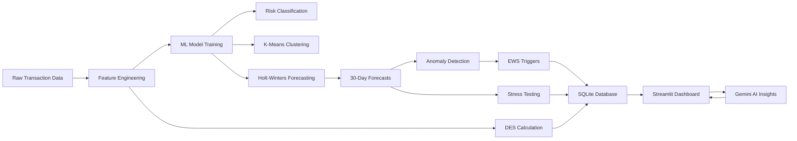

<div align="center">

# FinPulse — Dynamic Exposure Monitor

[](https://finpulse-4emtrj3zww3kb4cmfxi6vl.streamlit.app/)

> **Live Demo:** [https://finpulse-4emtrj3zww3kb4cmfxi6vl.streamlit.app/](https://finpulse-4emtrj3zww3kb4cmfxi6vl.streamlit.app/)

[](https://python.org)
[](https://streamlit.io)
[](https://scikit-learn.org)
[](https://plotly.com)
[](https://ai.google.dev)
[](LICENSE)

A proactive liquidity risk intelligence platform that monitors **1,000 retail banking customers** across **8 behavioral segments**, forecasts financial health **30 days ahead** using Holt-Winters Exponential Smoothing, and triggers **Early Warning Signals** before customers enter financial distress.

[Live Demo](#-live-preview) · [Features](#-features) · [ML Pipeline](#-machine-learning-pipeline) · [How It Works](#-how-it-works) · [Architecture](#-architecture) · [Quick Start](#-quick-start) · [Tech Stack](#-tech-stack)

</div>

---

## 📌 Problem Statement

Traditional banking risk systems operate reactively — flagging financial problems **after** a customer has already entered overdraft. This results in accrued fees, damaged customer trust, and limited opportunity for meaningful intervention.

**FinPulse** addresses this gap by shifting risk monitoring from reactive to **predictive**. Using time-series forecasting, classification models, and real-time anomaly detection, the system identifies at-risk customers **days to weeks in advance**, enabling relationship managers to intervene with appropriately targeted financial products.

| Reactive Approach | FinPulse Approach |
|:---|:---|
| Flags issues after overdraft occurs | Predicts risk 30 days ahead using ML models |
| Manual portfolio review | Automated EWS alerts with priority tiers |
| Uniform treatment across customers | 8 behavioral segments with tailored actions |
| Static reports | Real-time interactive dashboards with AI insights |

---

## 🖥 Live Preview

> **Live App:** [https://finpulse-4emtrj3zww3kb4cmfxi6vl.streamlit.app/](https://finpulse-4emtrj3zww3kb4cmfxi6vl.streamlit.app/)

### View 1 — Population Risk Intelligence
Bank-wide risk overview for risk managers: KPI cards, liquidity exposure heatmap, EWS console, revenue opportunity signals.


### Segment Deep-Dive with Forecast Chart
Interactive time-series showing historical vs. forecast median balance with confidence bands, stress scenario, and market divergence signals.


### View 2 — Customer Exposure Detail
Individual customer drill-down: 30-day balance forecast, DES history, stress test simulator, anomaly markers, and AI-generated personal insights.


---

## ✨ Features

### Population Risk Intelligence (Bank-Wide View)
- **KPI Summary** — Customers at liquidity risk, P1 EWS signal count, highest exposure segment, upsell opportunities
- **Liquidity Exposure Heatmap** — Segment × week matrix showing percentage of customers breaching risk tolerance thresholds, color-coded from green (safe) to red (critical)
- **EWS Console** — Priority 1 alert table ranked by breach severity with segment-specific recommended actions
- **Revenue Opportunity Signals** — Cross-sell and upsell product recommendations mapped to each segment's behavioral profile
- **Segment Deep-Dive** — Forecast chart with historical trend, Holt-Winters prediction, naive baseline comparison, 10% stress scenario, and confidence bands
- **AI Intervention Recommendation** — Gemini-generated, data-driven 2-sentence risk summary with specific action recommendation

### Customer Exposure Detail (Individual Drill-Down)
- **Customer KPI Cards** — Current balance, Dynamic Exposure Score, liquidity runway (days), spend velocity ratio
- **Active EWS Banners** — Auto-displayed critical overdraft risk and seasonal spike alerts with recommended actions
- **30-Day Forecast Chart** — Up to 8 overlaid traces including actual balance, Holt-Winters forecast, 80% confidence band, naive baseline, stress scenario, overdraft zone, and anomaly markers
- **Stress Test Simulator** — Enter any immediate spend amount (£0–£20,000) and watch the forecast shift in real-time to reveal capital adequacy impact
- **DES History** — 90-day sparkline with GREEN (≥60) and RED (<35) threshold lines
- **AI Personal Insight** — Customer-facing, plain-English financial guidance generated by Gemini

---

## 🤖 Machine Learning Pipeline

The project includes a complete, end-to-end ML pipeline (`ml_pipeline.py`) that generates data, engineers features, trains models, runs statistical tests, and saves all metrics and visualizations.

### Classification — Risk Tier Prediction
- **Models:** Logistic Regression (baseline) and Random Forest Classifier (ensemble)
- **Target:** Risk Tier (`High`, `Medium`, `Low`) derived from DES score thresholds
- **Features:** 11 engineered behavioral features per customer (balance stats, trend, volatility, runway, velocity)
- **Evaluation:** Stratified 80/20 split, Classification Report, Confusion Matrix, ROC Curves, Feature Importance

### Unsupervised Clustering — Customer Segmentation
- **Algorithm:** K-Means Clustering with Elbow Method and Silhouette Coefficient evaluation (k=2 to k=12)
- **Visualization:** PCA 2D projection with cluster-segment cross-tabulation
- **Purpose:** Validates whether financial behaviors naturally cluster into the 8 predefined segments

### Time-Series Forecasting — 30-Day Balance Prediction
- **Primary Model:** Holt-Winters Additive Exponential Smoothing (weekly seasonality, `seasonal_periods=7`)
- **Fallback 1:** Holt-Winters Trend-Only (if insufficient seasonal data)
- **Fallback 2:** Linear Trend Extrapolation via `np.polyfit` (if model fails to converge)
- **Confidence Intervals:** 80% CI using `±1.28 × residual_std`

### Statistical Hypothesis Testing
- **ANOVA** — Tests if mean balance differs significantly across 8 segments
- **Chi-Square** — Tests independence between risk tier and customer segment
- **T-Test** — Compares DES scores between `stable_salaried` vs `sme_distressed`
- **Pearson Correlation** — Linear relationship between balance and DES
- **Spearman Correlation** — Monotonic relationship between spend velocity and DES

### Anomaly Detection — Early Warning Signals
- **Method:** Statistical anomaly detection comparing actual balances against model predictions
- **CRITICAL_EWS:** Balance falls below forecast lower confidence bound
- **HIGH_VARIANCE:** Deviation exceeds 2× historical standard deviation

---

## 🧠 How It Works

### Dynamic Exposure Score (DES)

The core risk metric. A composite financial health score from **0 to 100**, computed as:

```
DES = 0.40 × Balance Buffer
    + 0.25 × Liquidity Runway
    + 0.20 × Spend Velocity (inverse)
    + 0.15 × Income Gap
```

| Band | Score | Interpretation |
|:---:|:---:|:---|
| 🟢 GREEN | 60 – 100 | Financially healthy — eligible for growth products |
| 🟡 AMBER | 35 – 59 | Requires monitoring — potential intervention candidate |
| 🔴 RED | 0 – 34 | At risk — immediate intervention recommended |

### Feature Engineering

Per-customer behavioral features are aggregated from 90 days of daily time-series data:

| Feature | Calculation | Business Purpose |
|:---|:---|:---|
| `bal_mean`, `bal_std` | Mean & Std. Dev. of daily balance | Average wealth & volatility |
| `bal_trend` | Slope from linear regression (`np.polyfit`) | Structural trajectory (£/day) |
| `bal_cv` | Coefficient of Variation (σ/μ) | Normalized volatility |
| `fhs_mean`, `fhs_std` | Mean & Std. Dev. of DES score | Financial health stability |
| `runway_mean` | Mean liquidity runway (days) | Time-to-insolvency |
| `vel_mean`, `vel_max` | Mean & peak spend velocity ratio | Spending acceleration detection |

### Anomaly Detection — Early Warning Signals (EWS)

Two-tier severity system that compares actual balances against model predictions:

| Severity | Trigger Condition | Response Protocol |
|:---|:---|:---|
| **P1 — CRITICAL** | Actual balance fell below the forecast lower confidence bound | Immediate intervention — escalate to relationship manager |
| **P2 — HIGH VARIANCE** | Significant deviation from expected pattern (above threshold) | Enhanced monitoring — schedule next-day review |

### Stress Testing

Two levels of capital adequacy stress testing:

1. **Customer-level** — Enter an immediate spend amount, the entire 30-day forecast shifts to simulate capital outflow impact
2. **Segment-level** — 10% income shock applied to all forecasts, revealing which segments breach capital adequacy under macroeconomic pressure

### Gemini AI Integration

Two structured prompt templates feed customer/segment metrics to **Gemini 1.5 Flash** and return context-aware natural language insights:

| Prompt Target | Audience | Output |
|:---|:---|:---|
| `seg_ai_prompt()` | Head of Retail Risk | 2-sentence risk assessment with specific action recommendation |
| `cust_ai_prompt()` | Customer advisor / Customer-facing | 2-sentence plain-English financial guidance with one practical action |

The system degrades gracefully — if the API key is absent or the call fails, pre-computed static fallback messages are displayed.

---

## 👥 Customer Segmentation

Eight behavioral segments, each with distinct risk profiles, product opportunities, and EWS response actions:

| Segment | Risk Level | Product Opportunity | EWS Action |
|:---|:---:|:---|:---|
| **Stable Salaried** | Low | Savings & investment products | Monitor only |
| **Stretched Salaried** | High | Micro-buffer / overdraft intervention | Offer £200 interest-free buffer before payday gap |
| **Gig Worker** | Medium-High | Flexible credit, income smoothing | Trigger income-smoothing product outreach |
| **Freelancer** | Medium | Invoice financing, cash flow loan | Flag for invoice financing conversation |
| **Young Professional** | Medium-Low | Wealth onboarding, ISA products | Send ISA / savings prompt — churn prevention |
| **Near Retiree** | Low | Wealth management, pension advice | Monitor only |
| **SME Seasonal** | Medium | Working capital loan (trough months) | Pre-approve working capital facility for trough period |
| **SME Distressed** | Very High | Early intervention, loan restructuring | Escalate to relationship manager — Priority 1 |

---

## 🏗 Architecture

```
┌─────────────────────────────────────────────────────────────────┐
│                       Streamlit Frontend                        │
│   ┌──────────────────┐  ┌──────────────────┐                   │
│   │  Population View │  │  Customer View   │                   │
│   │  ├ KPI Cards     │  │  ├ KPI Cards     │                   │
│   │  ├ Heatmap       │  │  ├ Forecast Chart│                   │
│   │  ├ EWS Console   │  │  ├ DES History   │                   │
│   │  ├ Deep-Dive     │  │  ├ Stress Test   │                   │
│   │  └ AI Insight    │  │  └ AI Insight    │                   │
│   └──────────────────┘  └──────────────────┘                   │
├─────────────────────────────────────────────────────────────────┤
│                   Plotly Visualization Layer                     │
│   chart_heatmap()  ·  chart_seg()  ·  chart_customer()         │
├─────────────────────────────────────────────────────────────────┤
│                    ML & Analytics Layer                          │
│   Risk Classification (RF/LR)  ·  K-Means Clustering           │
│   Holt-Winters Forecasting  ·  Statistical Hypothesis Testing   │
│   Anomaly Detection  ·  Feature Engineering  ·  EWS Engine      │
├─────────────────────────────────────────────────────────────────┤
│                      Gemini AI Layer                            │
│   Risk Analyst Prompts  ·  Customer Advisor Prompts            │
├─────────────────────────────────────────────────────────────────┤
│                   Data Layer (SQLite + CSV)                      │
│   finpulse.db  ·  population  ·  forecasts  ·  anomalies       │
│   segment_summary  ·  segment_forecasts  ·  forecast_meta      │
└─────────────────────────────────────────────────────────────────┘
```

### Data Pipeline



---

## 📁 Project Structure

```
FinPulse/
│
├── app.py                         # Entry point — Streamlit orchestrator
├── ml_pipeline.py                 # End-to-end ML pipeline orchestrator
├── generate_data.py               # Synthetic data generator (1,000 customers)
├── requirements.txt               # All Python dependencies
├── .gitignore                     # Security — excludes API keys & secrets
│
├── src/                           # Source modules
│   ├── config.py                  # Segments, labels, colors, EWS actions
│   ├── data_loader.py             # SQLite/CSV loading with @st.cache_data
│   ├── ml_models.py               # Core ML engine — classification, clustering,
│   │                              #   forecasting, statistical tests, anomaly detection
│   ├── database.py                # SQLite database layer — schema, indexes, SQL queries
│   ├── ai_engine.py               # Gemini AI setup, prompts, API calls
│   ├── ews.py                     # Early Warning Signal logic
│   ├── styles.py                  # Custom CSS (pills, banners, AI boxes)
│   │
│   ├── charts/                    # Plotly chart builders
│   │   ├── heatmap.py             # Segment exposure heatmap
│   │   ├── segment.py             # Segment forecast time-series
│   │   └── customer.py            # Customer forecast + DES charts
│   │
│   └── views/                     # Dashboard views
│       ├── sidebar.py             # Navigation & controls
│       ├── population.py          # View 1 — Population risk intelligence
│       └── customer.py            # View 2 — Customer exposure detail
│
├── notebooks/                     # Analysis notebooks
│   └── eda_analysis.py            # Comprehensive EDA with hypothesis testing,
│                                  #   model evaluation, and 19 publication-ready plots
│
├── data/                          # Generated data (SQLite + CSV)
│   ├── finpulse.db                # SQLite database — indexed, production-ready
│   ├── population.csv             # 90,000 rows — daily customer balances
│   ├── population_meta.csv        # 1,000 rows — customer profiles & risk tiers
│   ├── segment_summary.csv        # 720 rows — historical segment aggregates
│   ├── forecasts.csv              # 30,000 rows — 30-day balance predictions
│   ├── segment_forecasts.csv      # 240 rows — segment-level forecasts
│   ├── anomalies.csv              # ~1,000 rows — detected anomaly events
│   └── forecast_meta.csv          # 1,000 rows — forecast summaries
│
├── model_results/                 # ML pipeline outputs
│   ├── customer_features.csv      # Engineered feature matrix (1,000 customers)
│   └── fig_01..fig_19.png         # 19 publication-ready analysis plots
│
└── assets/                        # Screenshots for documentation
    ├── preview_population.png
    ├── preview_deepdive.png
    └── preview_customer.png
```

---

## 🚀 Quick Start

### Prerequisites

- Python 3.10 or higher
- pip package manager

### 1. Clone the Repository

```bash
git clone https://github.com/Omkarjagtap15/FinPulse.git
cd FinPulse
```

### 2. Install Dependencies

```bash
pip install -r requirements.txt
```

### 3. Run the ML Pipeline (Optional — data is pre-generated)

```bash
python ml_pipeline.py
```

This generates synthetic data, trains all ML models (classification, clustering, forecasting), runs statistical hypothesis tests, and saves results to `data/` and `model_results/`.

### 4. Launch the Dashboard

```bash
streamlit run app.py
```

The dashboard opens at **http://localhost:8501**.

### 5. Configure Gemini AI *(Optional)*

To enable AI-generated insights, set your API key as an environment variable:

```bash
export GEMINI_API_KEY=your_api_key_here
```

Obtain a free API key at [Google AI Studio](https://aistudio.google.com/apikey). The dashboard functions fully without the key — AI sections will display pre-computed fallback insights.

---

## 🛠 Tech Stack

| Layer | Technology | Purpose |
|:---|:---|:---|
| **Machine Learning** | Scikit-Learn 1.9 | Classification (Random Forest, Logistic Regression), K-Means Clustering |
| **Time-Series** | Statsmodels | Holt-Winters Exponential Smoothing with seasonal decomposition |
| **Statistics** | SciPy | Hypothesis testing — ANOVA, Chi-Square, T-Test, Pearson & Spearman correlation |
| **Database** | SQLite | Indexed relational database with parameterized SQL queries |
| **Frontend** | Streamlit 1.56+ | Interactive dashboard framework |
| **Visualization** | Plotly 6.7, Matplotlib, Seaborn | Interactive charts, heatmaps, time-series, EDA plots |
| **Data Processing** | Pandas 3.x, NumPy 2.x | Data manipulation and feature engineering |
| **AI Engine** | Google Gemini 1.5 Flash | Natural language risk insights and recommendations |
| **Language** | Python 3.10+ | Core application language |

---

## 🔧 Configuration

All segment definitions, labels, product mappings, and color constants are centralized in `src/config.py` for easy customization:

```python
# Example: Adding a new customer segment
SEGMENTS.append("student")
SEG_LABEL["student"] = "University Student"
SEG_OPP["student"] = "Student account, budgeting tools"
EWS_ACTIONS["student"] = "Send budgeting notification"
```

---

## 📜 License

This project is licensed under the **Apache License 2.0**. See [LICENSE](LICENSE) for details.

---

## 🤝 Contributing

1. Fork the repository
2. Create a feature branch (`git checkout -b feature/your-feature`)
3. Commit your changes (`git commit -m 'Add feature'`)
4. Push to the branch (`git push origin feature/your-feature`)
5. Open a Pull Request

---

## Acknowledgments

- **Google** — Gemini AI platform
- **Streamlit** — Dashboard framework
- **Scikit-Learn** — Machine learning library

---

<div align="center">

**FinPulse** · Dynamic Exposure Monitor

[](https://streamlit.io)
[](https://ai.google.dev)
[](https://scikit-learn.org)

</div>
