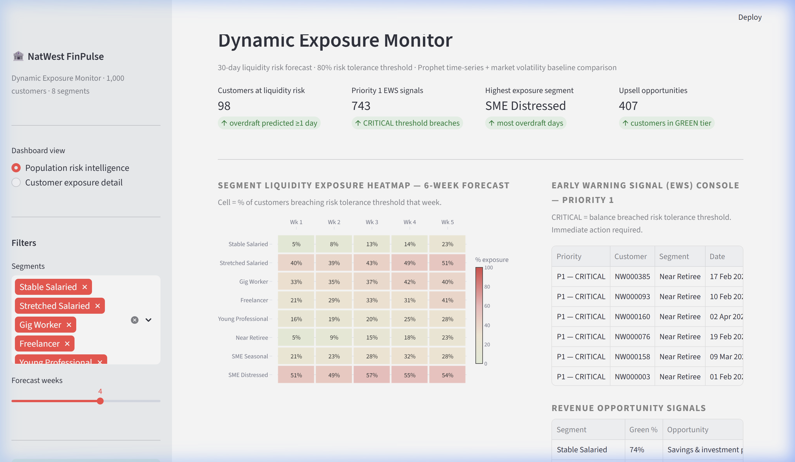
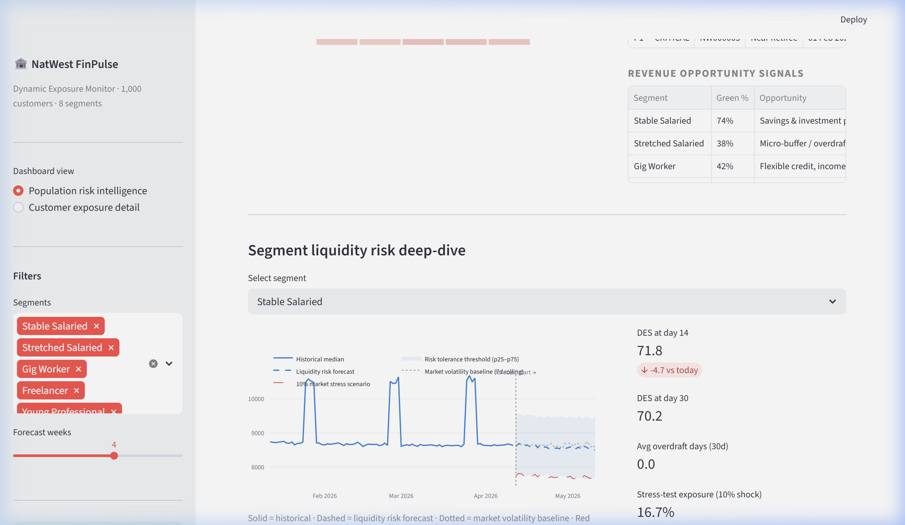
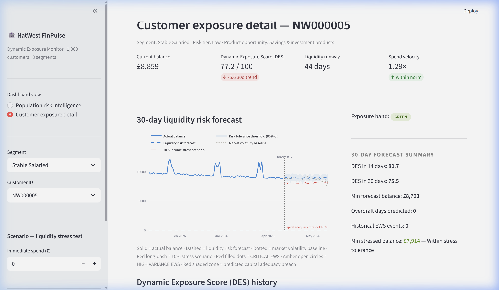
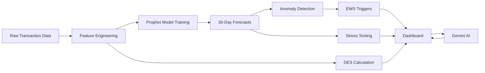

<div align="center">

# FinPulse — Dynamic Exposure Monitor

[](https://finpulse-4emtrj3zww3kb4cmfxi6vl.streamlit.app/)
> **Live Demo:** [https://finpulse-4emtrj3zww3kb4cmfxi6vl.streamlit.app/](https://finpulse-4emtrj3zww3kb4cmfxi6vl.streamlit.app/)

[](https://python.org)
[](https://streamlit.io)
[](https://plotly.com)
[](https://ai.google.dev)
[](LICENSE)

A proactive liquidity risk intelligence platform that monitors **1,000 retail banking customers** across **8 behavioral segments**, forecasts financial health **30 days ahead** using Prophet time-series modeling, and triggers **Early Warning Signals** before customers enter financial distress.

[Live Preview](#-live-preview) · [Features](#-features) · [Use Cases](#-hackathon-use-cases-addressed) · [How It Works](#-how-it-works) · [Architecture](#-architecture) · [Quick Start](#-quick-start) · [Tech Stack](#-tech-stack) · [Team](#-team-contributions)

</div>

---

## 📌 Problem Statement

Traditional banking risk systems operate reactively — flagging financial problems **after** a customer has already entered overdraft. This results in accrued fees, damaged customer trust, and limited opportunity for meaningful intervention.

**FinPulse** addresses this gap by shifting risk monitoring from reactive to **predictive**. Using time-series forecasting and real-time anomaly detection, the system identifies at-risk customers **days to weeks in advance**, enabling relationship managers to intervene with appropriately targeted financial products.

| Reactive Approach | FinPulse Approach |
|:---|:---|
| Flags issues after overdraft occurs | Predicts risk 30 days ahead |
| Manual portfolio review | Automated EWS alerts with priority tiers |
| Uniform treatment across customers | 8 behavioral segments with tailored actions |
| Static reports | Real-time interactive dashboards with AI insights |

---

## 🖥 Live Preview

> **Launch locally:** `streamlit run app.py` → opens at **http://localhost:8501**

### View 1 — Population Risk Intelligence
Bank-wide risk overview for risk managers: KPI cards, liquidity exposure heatmap, EWS console, revenue opportunity signals.



### Segment Deep-Dive with Forecast Chart
Interactive time-series showing historical vs. forecast median balance with confidence bands, stress scenario, and market divergence signals.



### View 2 — Customer Exposure Detail
Individual customer drill-down: 30-day balance forecast, DES history, stress test simulator, anomaly markers, and AI-generated personal insights.



---

## ✨ Features

### Population Risk Intelligence (Bank-Wide View)
- **KPI Summary** — Customers at liquidity risk, P1 EWS signal count, highest exposure segment, upsell opportunities
- **Liquidity Exposure Heatmap** — Segment × week matrix showing percentage of customers breaching risk tolerance thresholds, color-coded from green (safe) to red (critical)
- **EWS Console** — Priority 1 alert table ranked by breach severity with segment-specific recommended actions
- **Revenue Opportunity Signals** — Cross-sell and upsell product recommendations mapped to each segment's behavioral profile
- **Segment Deep-Dive** — Forecast chart with historical trend, Prophet prediction, naive baseline comparison, 10% stress scenario, and confidence bands
- **AI Intervention Recommendation** — Gemini-generated, data-driven 2-sentence risk summary with specific action recommendation

### Customer Exposure Detail (Individual Drill-Down)
- **Customer KPI Cards** — Current balance, Dynamic Exposure Score, liquidity runway (days), spend velocity ratio
- **Active EWS Banners** — Auto-displayed critical overdraft risk and seasonal spike alerts with recommended actions
- **30-Day Forecast Chart** — Up to 8 overlaid traces including actual balance, Prophet forecast, 80% confidence band, naive baseline, stress scenario, overdraft zone, and anomaly markers
- **Stress Test Simulator** — Enter any immediate spend amount (£0–£20,000) and watch the forecast shift in real-time to reveal capital adequacy impact
- **DES History** — 90-day sparkline with GREEN (≥60) and RED (<35) threshold lines
- **AI Personal Insight** — Customer-facing, plain-English financial guidance generated by Gemini

---

## 🎯 Hackathon Use Cases Addressed

This platform directly addresses the core hackathon themes of **Predictive Forecasting** and **AI-Driven Customer Insights**:

| Use Case | How FinPulse Addresses It |
|:---|:---|
| **Spot Trouble Early** | The EWS engine detects sudden dips in the worst-case forecast range, identifying overdraft breaches and seasonal income spikes *before* they occur — not after. |
| **Explanations for Non-Experts** | Gemini AI strips away statistical jargon. Instead of showing a customer a "p25 lower bound variance," it tells them: *"You have 14 days of liquidity runway. Consider reducing spend this week."* |
| **Understand Uncertainty** | Risk tolerance thresholds are visually represented using shaded confidence bands, demonstrating that forecasting operates in probability ranges — not exact numbers. |
| **Compare Plans** | The interactive scenario slider enables "What-if" stress testing for immediate capital outflows, showing users the precise consequence of a large purchase on their 30-day forecast. |
| **Revenue Generation** | Low-risk customer profiles (high DES scores) are correlated with specific NatWest product up-sells — ISAs, Wealth Management, Invoice Financing — surfaced through Revenue Opportunity Signals. |

---

## 🧠 How It Works

### Dynamic Exposure Score (DES)

The core risk metric. A composite financial health score from **0 to 100**, computed as:

```
DES = 0.40 × Balance Buffer
    + 0.25 × Liquidity Runway
    + 0.20 × Spend Velocity (inverse)
    + 0.15 × Income Gap
```

| Band | Score | Interpretation |
|:---:|:---:|:---|
| 🟢 GREEN | 60 – 100 | Financially healthy — eligible for growth products |
| 🟡 AMBER | 35 – 59 | Requires monitoring — potential intervention candidate |
| 🔴 RED | 0 – 34 | At risk — immediate intervention recommended |

### Time-Series Forecasting (Prophet)

The forecasting layer uses **Facebook Prophet** to generate 30-day balance predictions from 90 days of historical data:

- **Trend decomposition** — Separates long-term direction from cyclical patterns
- **Multi-seasonality** — Captures weekly (weekend spending) and monthly (salary cycle) patterns
- **Uncertainty quantification** — Produces 80% confidence intervals, not point estimates
- **Robustness** — Handles missing data and outliers inherent in real banking data

A **naive baseline** (7-day rolling average) runs in parallel. When the Prophet forecast diverges significantly from the baseline (>£100), a **Market Divergence Signal** flags a potential structural shift such as interest rate impact or regional economic stress.

### Anomaly Detection — Early Warning Signals (EWS)

Two-tier severity system that compares actual balances against model predictions:

| Severity | Trigger Condition | Response Protocol |
|:---|:---|:---|
| **P1 — CRITICAL** | Actual balance fell below the Prophet lower confidence bound | Immediate intervention — escalate to relationship manager |
| **P2 — HIGH VARIANCE** | Significant deviation from expected pattern (above threshold) | Enhanced monitoring — schedule next-day review |

### Stress Testing

Two levels of capital adequacy stress testing:

1. **Customer-level** — Enter an immediate spend amount, the entire 30-day forecast shifts to simulate capital outflow impact
2. **Segment-level** — 10% income shock applied to all forecasts, revealing which segments breach capital adequacy under macroeconomic pressure

### Gemini AI Integration

Two structured prompt templates feed customer/segment metrics to **Gemini 1.5 Flash** and return context-aware natural language insights:

| Prompt Target | Audience | Output |
|:---|:---|:---|
| `seg_ai_prompt()` | Head of Retail Risk | 2-sentence risk assessment with specific NatWest action recommendation |
| `cust_ai_prompt()` | Customer advisor / Customer-facing | 2-sentence plain-English financial guidance with one practical action |

The system degrades gracefully — if the API key is absent or the call fails, pre-computed static fallback messages are displayed.

---

## 👥 Customer Segmentation

Eight behavioral segments, each with distinct risk profiles, product opportunities, and EWS response actions:

| Segment | Risk Level | Product Opportunity | EWS Action |
|:---|:---:|:---|:---|
| **Stable Salaried** | Low | Savings & investment products | Monitor only |
| **Stretched Salaried** | High | Micro-buffer / overdraft intervention | Offer £200 interest-free buffer before payday gap |
| **Gig Worker** | Medium-High | Flexible credit, income smoothing | Trigger income-smoothing product outreach |
| **Freelancer** | Medium | Invoice financing, cash flow loan | Flag for invoice financing conversation |
| **Young Professional** | Medium-Low | Wealth onboarding, ISA products | Send ISA / savings prompt — churn prevention |
| **Near Retiree** | Low | Wealth management, pension advice | Monitor only |
| **SME Seasonal** | Medium | Working capital loan (trough months) | Pre-approve working capital facility for trough period |
| **SME Distressed** | Very High | Early intervention, loan restructuring | Escalate to relationship manager — Priority 1 |

---

## 🏗 Architecture

```
┌─────────────────────────────────────────────────────────────────┐
│                       Streamlit Frontend                        │
│   ┌──────────────────┐  ┌──────────────────┐                   │
│   │  Population View │  │  Customer View   │                   │
│   │  ├ KPI Cards     │  │  ├ KPI Cards     │                   │
│   │  ├ Heatmap       │  │  ├ Forecast Chart│                   │
│   │  ├ EWS Console   │  │  ├ DES History   │                   │
│   │  ├ Deep-Dive     │  │  ├ Stress Test   │                   │
│   │  └ AI Insight    │  │  └ AI Insight    │                   │
│   └──────────────────┘  └──────────────────┘                   │
├─────────────────────────────────────────────────────────────────┤
│                   Plotly Visualization Layer                     │
│   chart_heatmap()  ·  chart_seg()  ·  chart_customer()         │
├─────────────────────────────────────────────────────────────────┤
│                    Analytics & ML Layer                          │
│   DES Scoring  ·  Prophet Forecast  ·  Anomaly Detection       │
│   Stress Testing  ·  Naive Baseline  ·  EWS Engine             │
├─────────────────────────────────────────────────────────────────┤
│                      Gemini AI Layer                            │
│   Risk Analyst Prompts  ·  Customer Advisor Prompts            │
├─────────────────────────────────────────────────────────────────┤
│                    Data Layer (7 CSV Files)                      │
│   population · meta · segment_summary · forecasts              │
│   segment_forecasts · anomalies · forecast_meta                │
└─────────────────────────────────────────────────────────────────┘
```

### Data Pipeline



---

## 📁 Project Structure

```
NatWest-FinPulse/
│
├── app.py                         # Entry point — orchestrator (45 lines)
├── generate_data.py               # Synthetic data generator (1,000 customers)
├── .env                           # GEMINI_API_KEY=your_key_here
│
├── src/                           # Source modules
│   ├── config.py                  # Segments, labels, colors, EWS actions
│   ├── data_loader.py             # CSV loading with @st.cache_data
│   ├── ai_engine.py               # Gemini AI setup, prompts, API calls
│   ├── ews.py                     # Early Warning Signal logic
│   ├── styles.py                  # Custom CSS (pills, banners, AI boxes)
│   │
│   ├── charts/                    # Plotly chart builders
│   │   ├── heatmap.py             # Segment exposure heatmap
│   │   ├── segment.py             # Segment forecast time-series
│   │   └── customer.py            # Customer forecast + DES charts
│   │
│   └── views/                     # Dashboard views
│       ├── sidebar.py             # Navigation & controls
│       ├── population.py          # View 1 — Population risk intelligence
│       └── customer.py            # View 2 — Customer exposure detail
│
├── data/                          # Generated CSV data (7 files, ~150K rows total)
│   ├── population.csv             # 90,000 rows — daily customer balances
│   ├── population_meta.csv        # 1,000 rows — customer profiles
│   ├── segment_summary.csv        # 720 rows — historical segment aggregates
│   ├── forecasts.csv              # 30,000 rows — 30-day balance predictions
│   ├── segment_forecasts.csv      # 240 rows — segment-level forecasts
│   ├── anomalies.csv              # ~1,000 rows — detected anomaly events
│   └── forecast_meta.csv          # 1,000 rows — forecast summaries
│
└── assets/                        # Screenshots for documentation
    ├── preview_population.png
    ├── preview_deepdive.png
    └── preview_customer.png
```

---

## 🚀 Quick Start

### Prerequisites

- Python 3.10 or higher
- pip package manager

### 1. Clone the Repository

```bash
git clone https://github.com/your-username/natwest-finpulse.git
cd natwest-finpulse
```

### 2. Install Dependencies

```bash
pip install pandas numpy plotly streamlit python-dotenv google-generativeai
```

### 3. Generate Sample Data

```bash
python generate_data.py
```

This creates 7 CSV files in `data/` with synthetic financial data for 1,000 customers across 8 behavioral segments.

### 4. Configure Gemini AI *(optional)*

Create a `.env` file in the project root:

```
GEMINI_API_KEY=your_api_key_here
```

Obtain a free API key at [Google AI Studio](https://aistudio.google.com/apikey). The dashboard functions fully without the key — the "Generate ↗" buttons will display pre-computed fallback insights.

### 5. Launch the Dashboard

```bash
streamlit run app.py
```

The dashboard opens at **http://localhost:8501**.

---

## 🛠 Tech Stack

| Layer | Technology | Purpose |
|:---|:---|:---|
| **Frontend** | Streamlit 1.56+ | Interactive dashboard framework |
| **Visualization** | Plotly 6.7 | Interactive charts — heatmaps, time-series, scatter |
| **Data Processing** | Pandas 3.x, NumPy 2.x | Data manipulation and statistical computation |
| **AI Engine** | Google Gemini 1.5 Flash | Natural language risk insights and recommendations |
| **Configuration** | python-dotenv | Secure environment variable management |
| **Language** | Python 3.10+ | Core application language |

---

## 🔧 Configuration

All segment definitions, labels, product mappings, and color constants are centralized in `src/config.py` for easy customization:

```python
# Example: Adding a new customer segment
SEGMENTS.append("student")
SEG_LABEL["student"] = "University Student"
SEG_OPP["student"] = "Student account, budgeting tools"
EWS_ACTIONS["student"] = "Send budgeting notification"
```

---

## 👥 Team Contributions

To maintain strict Git DCO compliance, code continuity, and a clean commit history, this repository was managed and pushed through a single project lead. The architecture, modeling, and data synthesis were the result of a collaborative effort by a team of four:

| Member | Role | Key Contributions |
|:---|:---|:---|
| **Aryan** | Project Lead | Repository architecture, Streamlit UI/UX engineering, Gemini API integration, open-source compliance (Git/DCO) |
| **Aditya** | Data Engineer | Bank-grade synthetic data generation (`generate_data.py`), schema architecture, segment definition |
| **Omkar** | ML Engineer | Statistical forecasting logic, Early Warning Signal (EWS) anomaly detection, Dynamic Exposure Score (DES) mathematics |
| **Mehul** | UX & Documentation | UI/UX strategy, LLM prompt engineering, scenario testing, project documentation |

---

## 📜 License

This project is licensed under the **Apache License 2.0**. See [LICENSE](LICENSE) for details.

---

## 🤝 Contributing

1. Fork the repository
2. Create a feature branch (`git checkout -b feature/your-feature`)
3. Commit your changes (`git commit -m 'Add feature'`)
4. Push to the branch (`git push origin feature/your-feature`)
5. Open a Pull Request

---

## Acknowledgments

- **NatWest Group** — Hackathon challenge and domain context
- **Google** — Gemini AI platform
- **Meta** — Prophet time-series forecasting library
- **Streamlit** — Dashboard framework

---

<div align="center">

**NatWest FinPulse** · National Hackathon 2026 Submission

[](https://streamlit.io)
[](https://ai.google.dev)

</div>
